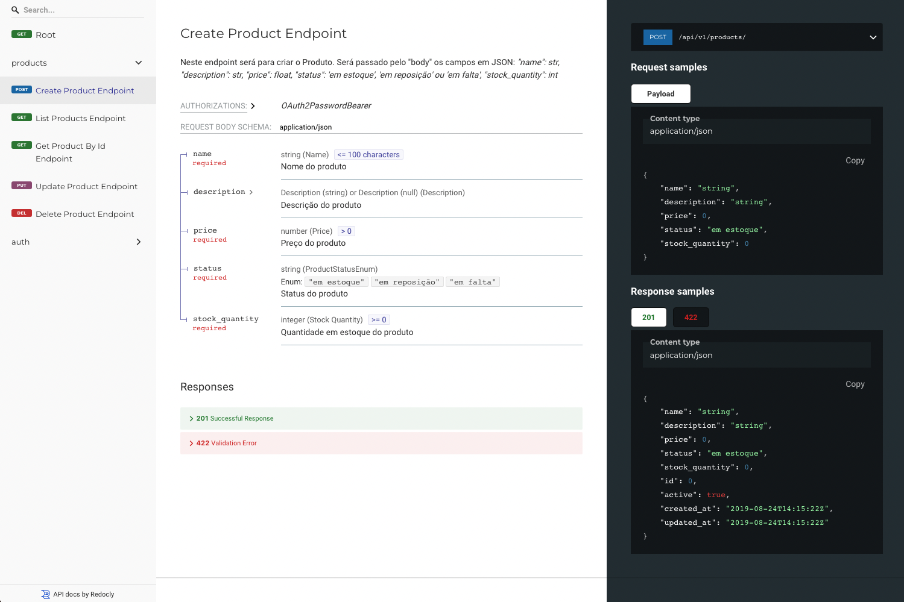
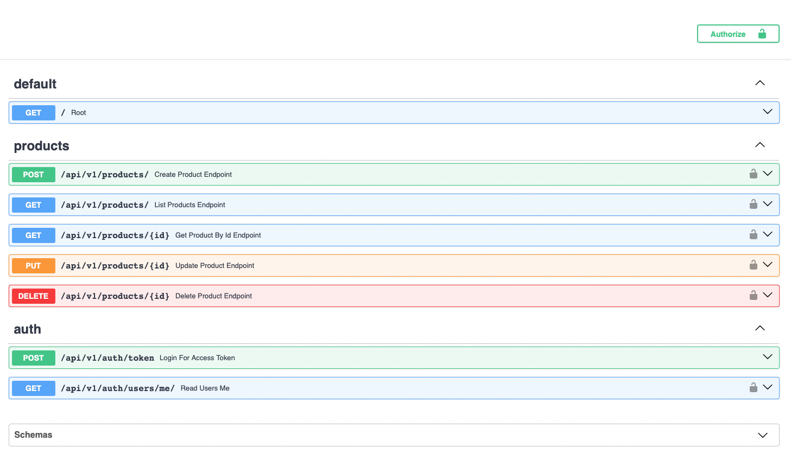
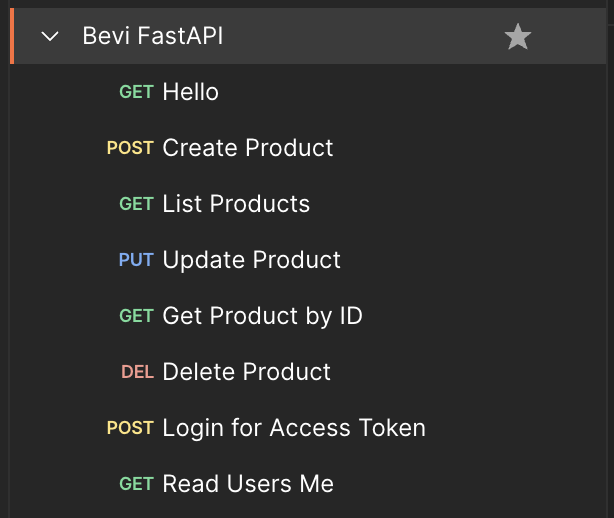
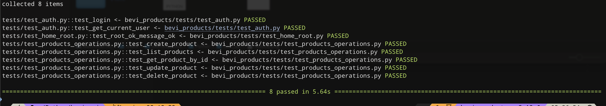

# FastApi (v1) para analise da Bevi

Desenvolvimento de API CRUD de Produtos em Python com FastAPI.

---

## Requisitos utilizados:

- Python 3.12.3
- FastAPI
- SQLAlchemy
- SQLite
- MongoDB
- Docker

---

### Instalação:

Depois de clonar o repositório, não tem segredo, é somente chamar os endpoints.

`docker-compose up --build -d`

[Documentação gerada pelo FastAPI](http://localhost:8000/api/v1/redoc): http://localhost:8000/api/v1/redoc

[EndPoints gerados pelo FastAPI](http://localhost:8000/api/v1/docs): http://localhost:8000/api/v1/docs

---

### EndPoints para o Postman:

### Execução dos Tests:
